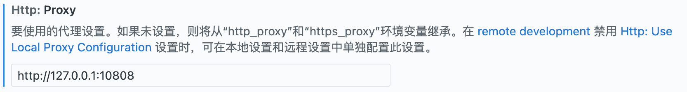

# 一、codex账号使用


## 原理
服务器上无法直接登录codex账号，需要用主机的codex auth.json文件进行自动登录，该文件包含了登录所需账号的**账号信息**以及**密钥**，
将该文件从主机上转移到服务器的.codex文件夹中，即可跳过在线登陆。

## 操作
* **主机路径**
  ```C:\Users\[用户名]\.codex\auth.json```
* **服务器路径**
  ```home\[用户名]\.codex ```

  ---

# 二、服务器网络配置（SSH反向端口转发remoteforward）

  ## 原理
  网络连接关系：
  ```
  ① 你本机  ── SSH 登录连接 ──>  服务器
  ② 服务器上的 Codex ── 经 SSH 隧道 ──> 你本机代理 ──> 互联网
  ```
  网络传输关系：
  ```
  普通（本地）隧道：
  电脑本地端口 → SSH → 服务器上的服务

  反向隧道：
  服务器本地端口 → SSH → 电脑上的服务
  ```

  ## 操作步骤

### 1.本地配置：文件位于本机电脑的C:\Users\[用户名]\.ssh\config
  ```
  Host thu-lab-maxon //服务器别名
    HostName [aaa.bbb.cc.dd]  //服务器地址
    User maxon  //用户名
    RemoteForward [10809] [127.0.0.1:10809] //服务器监听端口10809，反向隧道连接到电脑主机的10809端口，该端口为代理https端口
    ExitOnForwardFailure yes //创建不成功，就别继续连接
  ```
### 2.服务器代理配置
  在服务器~/.bashrc添加以下内容：
  ```
  // 服务器中http和https协议访问都通过10809代理访问
  export http_proxy=http://127.0.0.1:10809  
  export https_proxy=http://127.0.0.1:10809
  ```
  终端执行：
  ```
  // 立即重新执行文件
  source ~/.bashrc
  ```

### 3.服务器配置远程空间代理
   vscode中，中按下`Cmd/Ctrl + Shift + P`，输入`Open Remote Settings`，进入远程服务器的设置面板，搜索「proxy」，将： `http-proxy` 设置为       `http://127.0.0.1:10809`，如下图
  <p align="center">
  
  </p>

 然后关闭并重新连接 Remote：
`Cmd/Ctrl + Shift + P → Close Remote Connection`


