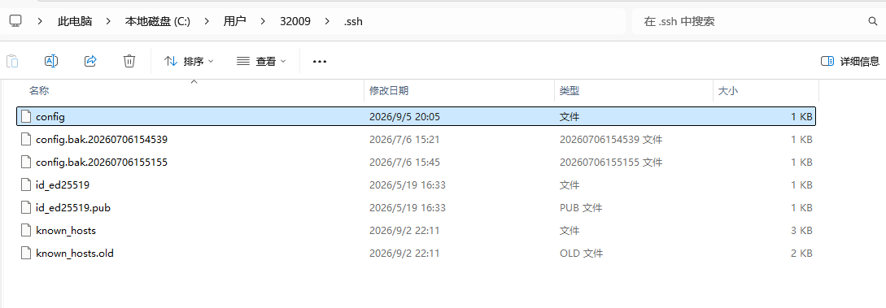
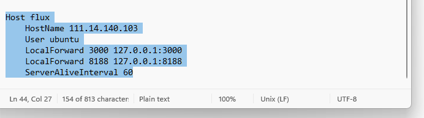

# 浏览器生图步骤
---
## 0.配置端口转发文件
用记事本打开```C:\Users\(用户名)\.ssh\config```
<table>
  <tr>
    <td align="center">
      
    </td>
  </tr>
</table>
添加以下配置代码：
```
Host flux
    HostName 111.14.140.103
    User ubuntu
    LocalForward 3000 127.0.0.1:3000 // 网页端端口
    LocalForward 8188 127.0.0.1:8188 //comfyui转发端口
    ServerAliveInterval 60
```
<table>
  <tr>
    <td align="center">
      
    </td>
  </tr>
</table>

## 1.连接主机与服务器
bash:
```
ssh -ubuntu@111.14.140.103
```
或者直接输入`ssh flux`

输入密码登录；

## 2.主机浏览器输入端口：

```
http://127.0.0.1:3000/  //图像生成器网页端
http://127.0.0.1:8188/ //comfyui工作流网页端
```

---

# 原理

